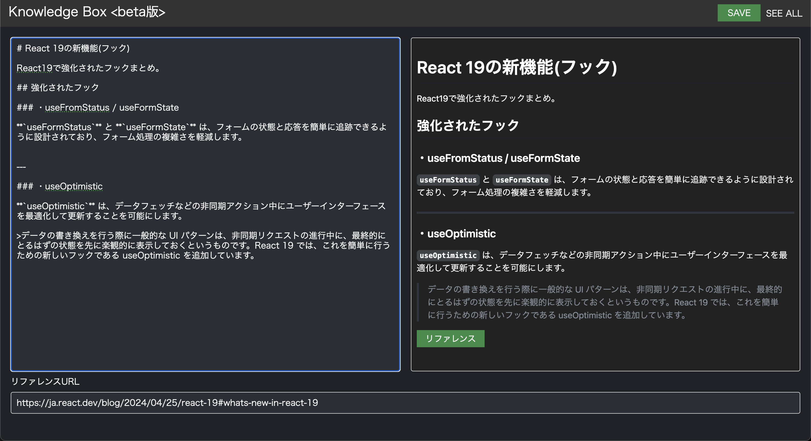
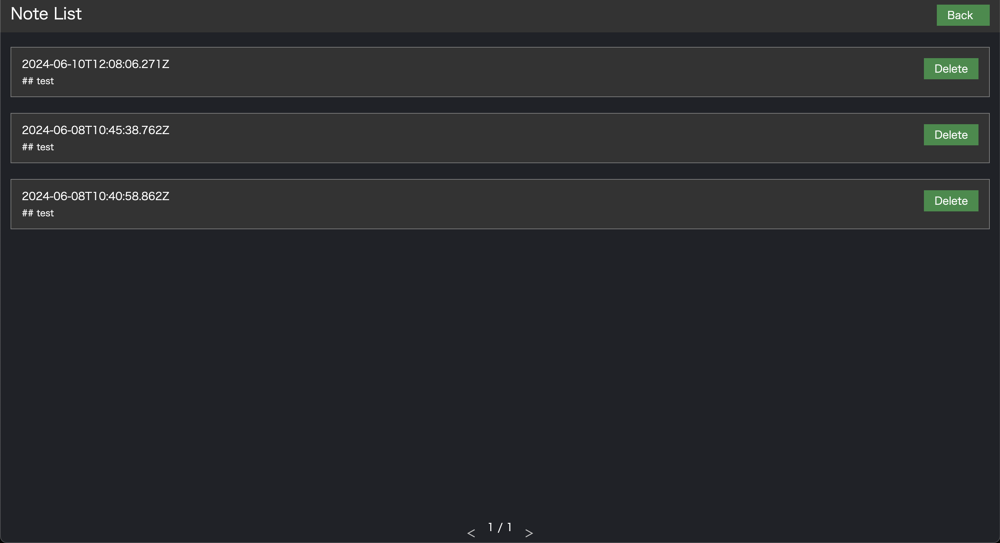

# Knowledge Box beta

## 概要

Knowledge Box beta は、知識をストックできるノートアプリです。</br>
私が過去に作ったアプリ、[Quick Quill](https://quick-quill.herokuapp.com/) を新たな技術スタックで最適化を試みたアプリになっております。</br>
※ 現在も絶賛、開発中のため beta としております。

## 画面

### エディター画面



### ノートリスト画面



## セットアップ手順

### 必要な前提条件

- Node.js v21.1.0
- npm または yarn

### インストール方法

1. リポジトリをクローンします。

```zsh
git clone https://github.com/yukisakakima/knowledge-box-beta.git
cd knowledge-box-beta
```

2. 依存関係をインストールします。

```zsh
npm install
yarn install
```

## 実行方法

### 開発環境での実行

```zsh
npm run dev
yarn dev
```

### デプロイ

```zsh
npm run deploy
yarn deploy
```

## 使用技術

- React v18
- TypeScript v5
- React Router
- styled-components v6.1.11
- Dexie
- ESLint v8
- GitHub Pages
